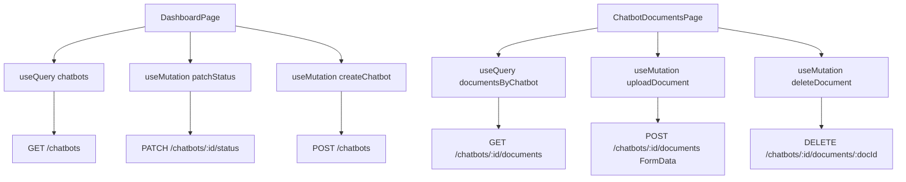

# Integração REST de Chatbots

## Objetivo

Substituir as chamadas atuais do SDK Base44 nas telas de chatbots/documentos por chamadas REST (`/api/...`) com React Query, mantendo o layout Tailwind e os componentes já existentes.

## Arquitetura de dados

- Criar um cliente HTTP central com `fetch` usando base relativa `/api`.
- Centralizar endpoints em uma camada de API para chatbots e documentos.
- Usar React Query para cache, invalidação e atualização otimista na deleção lógica.

## Arquivos a criar

- [front/src/lib/http-client.js](front/src/lib/http-client.js)
  - Wrapper `request()` com tratamento de erro HTTP e JSON.
- [front/src/api/chatbots.js](front/src/api/chatbots.js)
  - `listChatbots`, `createChatbot`, `toggleChatbotStatus`, `getChatbotById`.
- [front/src/api/documents.js](front/src/api/documents.js)
  - `listChatbotDocuments`, `uploadChatbotDocument`, `deleteChatbotDocument`.

## Arquivos a alterar

- [front/src/pages/Dashboard.jsx](front/src/pages/Dashboard.jsx)
  - Trocar query de listagem para `GET /chatbots`.
  - Trocar toggle para `PATCH /chatbots/:id/status`.
  - Trocar criação para `POST /chatbots`.
  - Adicionar toasts de sucesso/erro para criação.
- [front/src/pages/ChatbotDocuments.jsx](front/src/pages/ChatbotDocuments.jsx)
  - Buscar documentos com `GET /chatbots/:id/documents`.
  - Implementar deleção lógica com `DELETE /chatbots/:id/documents/:docId`.
  - Fazer atualização otimista para estado `pending_deletion` e desabilitar delete.
  - Adicionar toasts de sucesso/erro para deleção.
- [front/src/components/documents/DocumentUploader.jsx](front/src/components/documents/DocumentUploader.jsx)
  - Enviar via `FormData` para `POST /chatbots/:id/documents`.
  - Restringir envio para `.pdf`, `.docx`, `.pptx` (já existe validação; manter e endurecer na mutation).
  - Adicionar toasts de sucesso/erro para upload.
- [front/src/components/documents/DocumentList.jsx](front/src/components/documents/DocumentList.jsx)
  - Ajustar badge para texto `Pendente de Exclusão` quando `status === 'pending_deletion'`.
  - Desabilitar gatilho/botão de lixeira quando pendente.

## Regras funcionais

- Criação de chatbot:
  - Bloquear submit se `persona_prompt` ultrapassar 200 caracteres (já presente no modal; manter e garantir validação no submit).
- Upload:
  - Usar `FormData` com chave de arquivo (`file`) no endpoint por chatbot.
- Deleção lógica:
  - Marcar otimisticamente como `pending_deletion` na lista.
  - Em erro, rollback do cache e toast de erro.

## Estratégia React Query

- Query keys:
  - `['chatbots']`
  - `['chatbot', chatbotId]`
  - `['documents', chatbotId]`
- Invalidações:
  - Criação/switch: invalidar `['chatbots']`.
  - Upload/delete: invalidar `['documents', chatbotId]` e `['chatbots']`.
- Otimista na deleção:
  - `onMutate` atualiza status local.
  - `onError` restaura snapshot anterior.
  - `onSettled` invalida query do chatbot.

## Validação e verificação

- Rodar lint nos arquivos alterados.
- Testar manualmente fluxos:
  - listar bots, alternar status, criar bot com prompt válido/inválido,
  - upload de formato permitido e bloqueio de formato inválido,
  - delete com status pendente e botão desativado.

